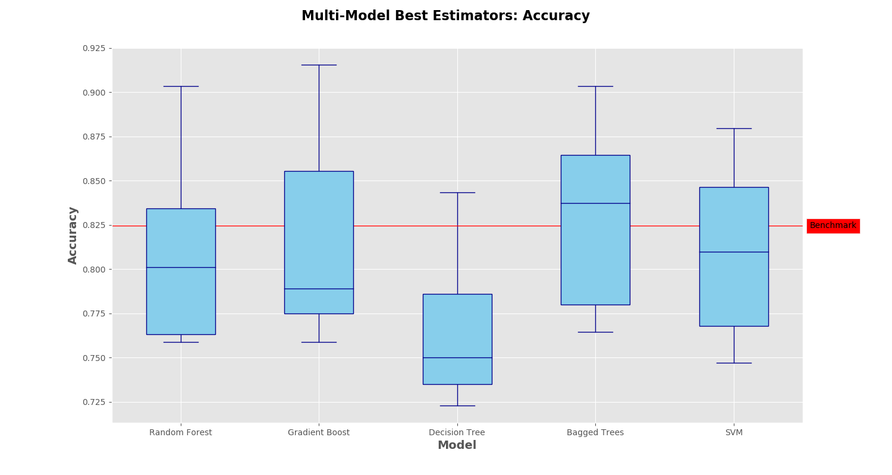
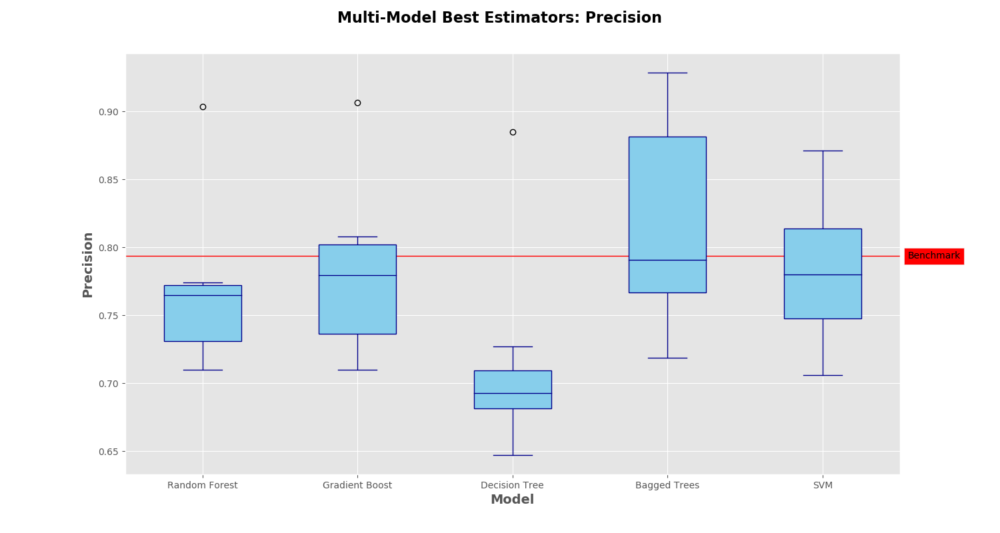
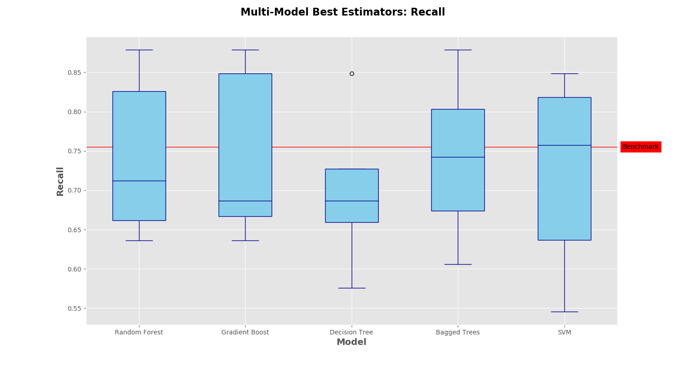

```{r setup, include=FALSE}
knitr::opts_chunk$set(echo = TRUE)
```

## EDA Recap

After getting to know the data during EDA, some general statements can be made with regard to survival status:

* A passenger's probability of surviving decreases as their socioeconomic status decreases.
* Given a passenger is male, he almost certainly died.
* Given a passenger is female, she most likely survived.
* Children had a higher probability of surviving than the elderly.
* A passenger's probability of surviving decreases as the number of siblings (or spouse) they have on board increases.

# Machine Learning Outline

Using some of the insights (summarized above) that were extracted from the exploratory analysis, this part of the analysis will shift to machine learning, with the overarching goal being to correctly classify those who lived and those who died aboard the Titanic.

This section will be broken down into four parts:

1. **Data Cleaning** - As mentioned in the Exploratory Analysis, there are some Null and NaN values that needs to be taken care of.
2. **Create a Benchmark Model** - Logistic Regression with a few select coefficients.
3. **Multi-Model Testing** - Cross validate a variety of classification algorithms, performing minor grid searches over each.
4. **Algorithm Tuning and Explanation** - Choose the model with the highest accuracy, perform a more granular grid search and explain the mathematical foundations of the algorithm.
5. **Test Set Scoring** - Use the refined model to make predictions on the test set.

## Data Cleaning

First and Foremost, as mentioned briefly in the exploratory analysis with R, there is a small amount of data cleaning that needs to be performed before modeling. As it turns out, over 75% of the values in the Cabin column are empty strings. Initially, one might try grouping on the SipSp and Parch columns and then looking at the last names to determine any families that were traveling together. Hypothetically, this would then lead to some of the family members having entries in the Cabin column, and one could then impute the values from there. Unfortunately, when this was performed the theoretical family groupings either all had no entries in the Cabin column or they were all complete. This, paired with the fact that imputing over 75% of the values for a column could only be considered guesswork at best, lead to the decision to not include this column in the modeling process.

In addition, there are 177 NaN values in the Age column, which amounts to roughly 20% of the data set. Since this variable *will* be used in the modeling process, some imputation will be necessary. Instead of imputing the **entire** column mean for **all** of the missing values, the distortion to the distribution of the values can be minimized by getting a little more granular.

In order to do this, any NaN values in the Age column were imputed with the mean of a *subset* of the data. For each of the possible combinations of the distinct values in the Gender, Pclass and Title (a feature constructed out of the Name column, which appears to be a rough proxy for Age) columns, a subset was created by  masking the entire data set to only include observations in *that specific group,* and then the mean **of that subset** was imputed was for the NaN values **in that subset.** Doing this for all of the possible subsets results in the 177 NaN being imputed in an intelligent manner.

Lastly, there were two observations that didn't have values in the Embarked column, which were droppped since there will be close to no affect going from 891 observations to 889 observations. In addition, if there hypothetically were an improvement in the error rate, it is unlikely that it would have been worth the time spent to work through an intelligent manner to impute those values.


## Benchmark Model - Logistic Regression

Using a total of eight columns ($Pclass$, $Sex$, $Age$, $SibSp$, $Parch$, $Fare$, $Embarked$, $Title$), some of which were one hot encoded, K-Fold cross validation with $K~=~8$ was used to get a sense of how simple logistic regression with ridge regularization would perform. The results are summarized in the table below.


| Metrics | Score |
| - | - |
| 8-Fold Accuracy | 82.45% |
| 8-Fold Precision | 79.36% |
| 8-Fold Recall | 75.51% |

Since there is no obvious reason why a false positive should be considered more costly than a false negative, accuracy will be the metric to beat for all subsequent modeling (precision and recall will still be reported). For all subsequent model evaluation, accuracy must be greater than 84% for the increase in model complexity to be worth the scrapping of the benchmark model.

## Multi-Model Testing

In order to determine if there is a model that will beat the benchmark, I chose five model frameworks to grid search over, ideally one of which would be a more superior model than the benchmark.

For each model architecture, a number of different models were built, the best model (*for the model architecture*) being determined using GridSearchCV's 3-Fold cross validation. Once the best estimator for a given framework was selected, I used 8-Fold cross validation on the training data to estimate which model, if any, has the highest chance of beating the benchmark. The training run times are summarized in the table below, and the Accuracy, Precision and Recall of all model architectures are illustrated on the following pages against the benchmark model.

\hfill

| Model Architecture | Number of possible models tested | Run Time |
| - | - | - |
| Random Forest | 36 | 41 sec |
| Gradient Boosting | 90 | 33.7 sec |
| Decision Tree | 4 | 0 sec |
| Bagging | 24 | 30.9 sec |
| Support Vector Machine | 32 | 318.7 min |





## Algorithm Tuning and Explanation

Upon first glance, it seems rather shocking that Bagged Decision Tree's outperformed some of the more complex architectures, such as Gradient Boosting or a Random Forest. However, with a closer look, the $max~features$ parameter, **when not equal to 1**, allows each decision tree to have access to only a subset of the feature space. In a 1998 paper by T.Ho^1^, this ensemble method was coined a *Decision Forest*, a different albiet similar method to Random Forests.

Recall that a Random Forest is a collection of decision trees, each tree being built on a bootstrapped data set. At each split within any given tree, only a random sample of the predictors are available as candidates on which to create the split. This process decorrelates the trees so that when multiple learners are averaged together, variance is reduced and the algorithm generalizes well.

A Decision Forest is slightly different. Each tree within a Decision Forest is built on the entire training data (not bootstrapped), however each tree **only has access to a random subset of the predictors.** Every node within a tree is then allowed to consider the full feature space **within the already filtered feature space for that tree.** For example, if one is working with a **n x 12** data set, each tree within a Decision Forest will utilized all *n* observations, but only a random subset of the 12 features.

With a broader and more refined grid search, the optimal number of estimators seems to fluctuate around 350, with the optimal number of features being 13. These are the parameters that will be used when pitted against the benchmark model on the test set.

## Test Set Scoring

Once the optimal hyperparameters were determined for the Decision Forest, I used both the benchmark (logistic regression) and the Decision Forest on the held out validation set, where the Decision Forest scored 87%, 3 percentage points higher than the benchmark set in the first section of the analysis. Since this is a Kaggle Competition and true test set values are known, I submitted test set prediction for both the Decision Forest and Logistic Regression models, shown in the table below. 

| Model | Validation Set Accuracy | Test Set Accuracy |
| - | - | - |
| Logistic Regression | 84.30% | 77.99% |
| Decision Forest | 87.00% | 77.51% |


### References
^1^ T. Ho, “The random subspace method for constructing decision forests”, Pattern Analysis and Machine Intelligence, 20(8), 832-844, 1998.